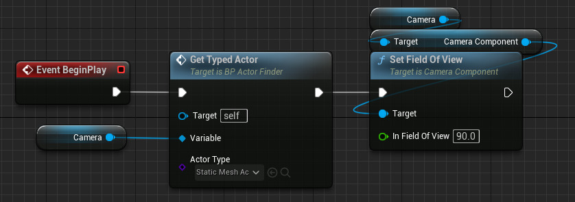

A [[Blueprint Class]] can have a [[Blueprint Variable]] of type [[Actor]].
This means that the [[Blueprint Class]] knows of some other [[Actor]] instance.

The variable can, for example, be initialized:
- By marking in Instance Editable and having a [[Level Designer]] set the variable on an instance of the [[Blueprint Class]].
- [[Spawn]] a new [[Actor]] during runtime and assign the newly created [[Actor]] to the variable.
- Find an existing [[Actor]] in the level with one of of the [[Get All Actors]] function.

An [[Actor]] variable can be more specifically typed.
For example, we can have a variable of type [[Camera]] [[Actor]].
Beware that it is possible, in some situations, to assign an [[Actor]] of the wrong type to a typed [[Actor]] variable.
For example, it is possible to assign an instance of a [[Blueprint Class]] inheriting from [[Actor]] to a [[Blueprint Variable]] having type [[Camera]] [[Actor]],
from within a [[Blueprint Function]] that takes the [[Camera]] [[Actor]] [[Blueprint Variable]] by reference as an [[Actor]] variable.
This will work, despite the mismatch, as long as you only use the API of a shared base class,
but if you call a [[Camera]]-specific function then you will get a runtime error.
For example, this is the error when trying to access the [[Camera Component]] property of a [[Camera]] [[Actor]] when the variable is pointing to something not a [[Camera]] [[Actor]]:
```
LogScript: Warning:
Attempted to access missing property 'CameraComponent'.
If this is a packaged/cooked build, are you attempting to use an editor-only property?
```

If you see this error message then trace the assignments to the [[Blueprint Variable]] and look for places where it may be assigned something that is not the correct type.

In some cases it can even lead to a crash:
```
Fatal error: [File:./Runtime/CoreUObject/Private/UObject/ScriptCore.cpp] [Line: 1459]    
Failed to find function <SOME BLUEPRINT FUNCTION> in <SOME BLUEPRINT TYPE> /Game/<PROJECT>/Levels/UEDPIE_0_<LEVEL NAME>.<LEVEL NAME>:PersistentLevel.<BLUEPRINT ACTOR NAME>
```

Example setup.
Camera is a variable of type [[Camera]] [[Actor]].
Notice that the type passed to Get Typed Actor isn't [[Camera]] [[Actor]] but [[Static Mesh]] [[Actor]].
Inside Get Typed Actor the by-reference parameter Variable is of the base type [[Actor]] so any type of [[Actor]] can be assigned to it,
and since the type passed to Get All Actors Of Class is also a parameter there is no way for the compiler to verify that the types match.
The Set Field Of View [[Execution Node]] will fail to evaluate its input pin since Camera, which should point to a [[Camera]] [[Actor]], actually points to a [[Static Mesh]] [[Actor]] which doesn't have a Camera Component.
A similar setup in C++ is rejected by the compiler, see [_How to pass pointer of derived class to reference to pointer of base class?_ at stackoverflow.com 2019](How to pass pointer of derived class to reference to pointer of base class?).




