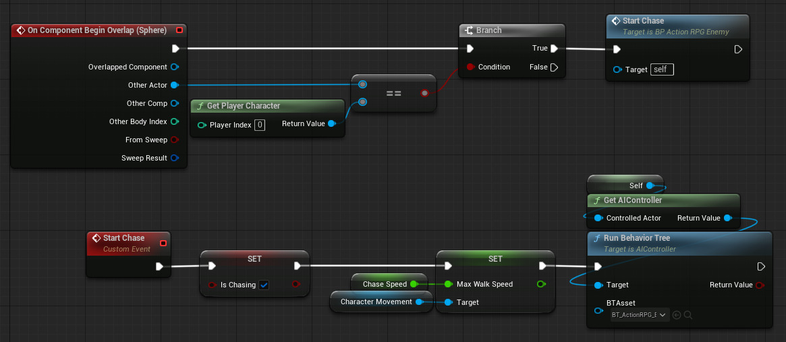

A [[Behavior Tree]] is an [[Asset]] that describe a tree of tasks that an AI-controlled [[Pawn]] should perform.
A Behavior Tree is used by an [[AI Controller]] to decide which of a set of  [[AI Task]]s to perform.
Run a [[Behavior Tree]] with the [[AI Controller]] > Run Behavior Tree function.
This function has a BTAsset input that is the Behavior Tree [[Asset]] to run.
Run Behavior Tree can be called from a [[Pawn]]'s [[Event Graph]] if that [[Pawn]] can be assumed to be AI-controlled [(1)](https://youtu.be/heoPNDwN57k?list=PLiDon2C0wI4tadc-85kLcDykqG4j6xIyc&t=280):

Create a new Behavior Tree with Content Browser > right-click > Artificial Intelligence > Behavior Tree.

A Behavior Tree contains a tree of nodes.
At the top of the tree is a root node.
Types of nodes:
- Selector
- Sequence
- Task

Create new nodes in the tree by click-and-drag off of the top or bottom of an existing node.

# Task

A [[AI Task]] is a [[Blueprint Class]]

# Blackboard

The Behavior Tree has a [[Blackboard]].
This is a place where the Behavior Tree can store data.
Switch to the [[Blackboard]] view with the Blackboard button in the top-right corner.
A [[Blackboard]] is a place where a Behavior Tree can store data.
It contains a list of Keys, which are kind of like [[Blueprint Variable]]s.
Create a new Key with the New Key button in the top-left corner.

# Provided Tasks

## Move To

Uses a [[Blackboard]] to know where to move.

# References

- 1: [_Unreal Engine 5 Tutorial - Action RPG Part 13: Enemy AI_ by Ryan Laley @ youtube.com 2024](https://youtu.be/heoPNDwN57k?list=PLiDon2C0wI4tadc-85kLcDykqG4j6xIyc)
