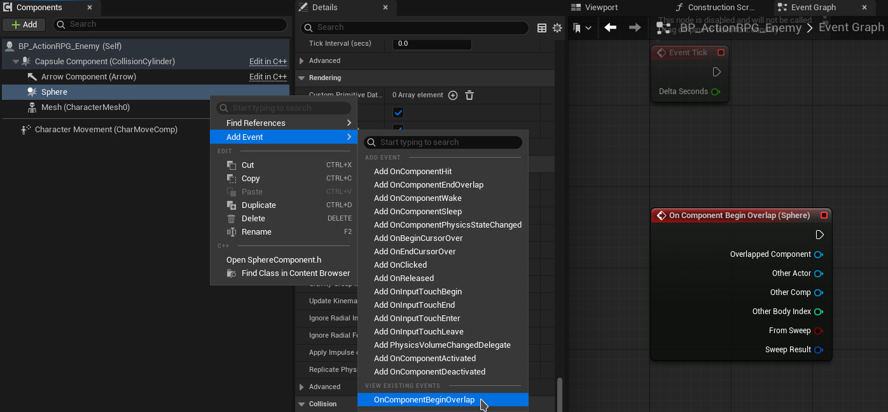

An event represents something that happens and some game logic that is executed when that something happens.

The "something that happens" part of an Events can exist as a [[Delegate]].
When the [[Delegate]] is triggered it means that the Event happened.

The "game logic" part of an Event can exist as an executable network in an [[Event Graph]] in the [[Blueprint Actor Editor]] for a [[Blueprint Class]].
An Event node is the root of a [[Blueprint Visual Script]] execution.
Event nodes are red.
Examples of Events are Begin Play, Tick, Destroyed, End Play, Begin Overlap, End Overlap.

We can create new Event execution root nodes for existing Events by right-clicking in the [[Event Graph]] and selecting the Event we want to react to, often found in the Add Event group.
In the [[Blueprint Actor Editor]], in the Details panel, we can also find the Events [[Category]] and click the + button next to any of the listed events, this will create a red event execution node in the [[Event Graph]].
Select different [[Component]]s in the [[Components Panel]] to see Events related to that particular [[Component]] type.
The same list of Events can be found with [[Components Panel]] > right-click a [[Component]] > Add Event.
This can also be used to locate already created Event nodes in the [[Event Graph]].

Connect [[Execution Node]]s to the Event node's output execution pin to build your game logic.
When the Event happens the nodes connected to the Event node's output execution pin are executed.

Example events are [[Begin Play]], mouse events, keyboard events, gameplay events, and so on.

See also:
- [[Custom Blueprint Event]]
- [[Input Event]]
