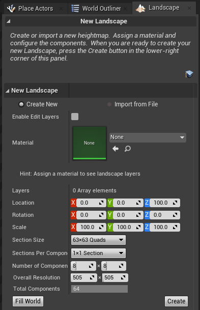

In the [[Landscape Mode]], make sure the Manage tab is selected, and the New tool within the Manage Tool Bar.

![[Images/Landscape_Mode_Manage_Tab_New_Tool.png]]

The Landscape Mode Panel shows the settings for the new Landscape we are about to create.

If you have a height map file then select Import From File.

Edit Layers is a feature allowing for non-destructive editing of the height map.
Edit Layers can be enabled on an already created [[Landscape]] from its [[Details Panel]], under the Landscape category.
When Edit Layers is enabled the Landscape panel in the [[Landscape Mode]] will contain the Edit Layers category.

The [[Landscape Material|Material]] is what decide what the Landscape will look like, its colors and such.
This can be changed later.

The Location and Rotation decide the where the Landscape is placed.
Scale in X and Y determines the resolution of the Landscape, i.e. the size of each quad.
Scale Z control the vertical resolution of the Landscape, and thus also the maximum displacement of the height field.

Set the settings and click Create.

After the [[Landscape]] has been created you can start [[Sculpt a Landscape]].
Or use [[Landmass]] to shape the [[Landscape]].
When you have the shape roughly in place  you can start to [[Paint Material on a Landscape]]

# References

- [_Advanced Skill Sets for Environment Art_ > _Landscape Sculpting and Landmass_ by Epic Online Learning 2022 UE4.27](https://dev.epicgames.com/community/learning/courses/Qwa/unreal-engine-advanced-skill-sets-for-environment-art/0Rz6/landscape-sculpting-and-landmass)
