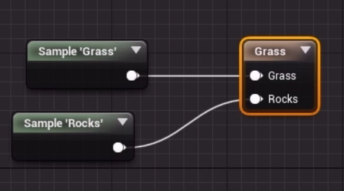

A [[Landscape Material]] can trigger the spawning of [[Foliage]].
Often used for grass and shrubbery, but any [[Static Mesh Asset]] can be used.
Rocks, twigs, paper mugs, and other clutter is common.
This is done by adding a **Landscape Grass Output** node to the [[Material]].
The Landscape Grass Output node show up as a Grass node.
The Details Panel of the Grass node has a **Grass Types** array.
This array contains instances of the [[Landscape Grass Type]] asset.

**[[Landscape Grass Type]]** is an asset type.
A new [[Landscape Grass Type]] is created with Content Drawer > right-click > Foliage > [[Landscape Grass Type]].
Or from the Grass node's [[Details Panel]] > Grass Types > array element > Grass Type > asset selection drop-down > Create New Asset > [[Landscape Grass Type]].
This is a [[Foliage]] type of asset so it often has the `F_` name prefix.

The [[Landscape Grass Type]] has a Grass Varieties array.
Each element in this array describe a [[Foliage]] type that can be spawned.
Each element has a Grass Mesh that is the [[Static Mesh Asset]] that should be rendered where this particular foliage has been spawned.
The other options control how the [[Static Mesh Asset]] will be scattered over the [[Landscape]].
Set Grass Density, Placement Jitter, and Scale X, Y, Z to get the wanted amount of grass.
Grass Density of about 100 is reasonable for small-ish grass meshes.
Set Start Cull Distance and End Cull Distance reasonably according to your visual fidelity vs performance trade-off.

In the [[Landscape Material]], on the Grass node, in the Grass Types array in the Details panel, select a Landscape Grass Type for Grass Type.

The location of the Landscape Grass Type instances is controlled with [[Landscape Painting]].
The Grass node is told about the [[Landscape Grass Type]] to Landscape Layer relationship with a [[Landscape Layer Sample]] node.
The [[Landscape Layer Sample]] node has a Parameter Name property that should be set to the name of the layer that should spawn instances set on the Grass node.
Connect the output pin of the Sample node to the input pin on the Grass node.
I think we can connect any scalar value to this pin, if we have some other way to determine where the [[Static Mesh]] should be spawned.

The following image shows an example [[Landscape Material]] with a Grass [[Landscape Blend Layers Material|Layer]] and a Rocks layer.
The green Sample nodes have their names because that is what the layers are named in the [[Landscape Layer Blend]] node.
The brown Grass node have the input names based on its [[Details Panel]] > Grass Types > array element > Name properties.
The two do not need to match.
The Sample 'Layer' nodes can also be added before being connected to the Grass node.
For example, by adding the Sample 'Grass' and Sample 'Rocks' outputs before passing to the Rocks input on the Grass node we cause the Rocks [[Landscape Grass Type]] to spawn both where Grass has been painted and where Rocks has been painted.

