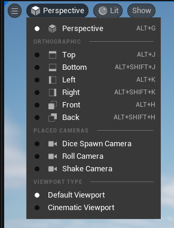

The Level Viewport is the part of the [[Level Editor]] where we can see the contents of our level.

There are various [[Viewport Camera Controls]].

# Object Selection

Click an [[Actor]] to select it.
Translucent objects cannot be selected by default.
Hit the T key to enable or disabled translucent object selection.

Hold CTRL+Alt+LMB and drag to select multiple objects.

The [[Transform Gizmo]] appears when one or more object are selected.
It is used to move, rotate, and scale objects in the level.

If a [[Static Mesh]] is selected then all [[Static Mesh|Static Meshes]] using that same [[Static Mesh Asset]] can be selected with right-click > Select > Static Meshes > {Select Matching (Selected Classes), Select Matching (All Classes)}.
I'm not sure what this does, exactly.

If a [[Static Mesh]] is selected that all [[Static Mesh]]es using the same [[Material]] can be selected with right-click > Select > Materials > Select All With Same Material.

I think Shift + E does something selection-related.

# View Settings And View Modes

There are several debug and performance [[View Mode|View Modes]] that can be selected from the top-left of the viewport.
The default is Lit.
A number of things to render can be toggled from the Show menu in the top-left of the Level Viewport.
Various statistics can be show on the Level Viewport with the [[Stat]] command.

Press and hold Ctrl and type L, keep holding Ctrl, and move the mouse to rotate the Directional Light in the level.
Release Ctrl to accept the new light setup.

Type G to toggle Game Mode, which when enabled hides icons for non-visible things such as [[Light Source|Light Sources]].

Type F11 to maximize the viewport, type it again to unmaximize.

With an [[Actor]] selected, type End to place it on whatever is beneath it.
Collision shapes will be used if available, otherwise the origin of the object is placed on top of the thing below.

Left-click an object in the Viewport to select it.
If this doesn't work then check the Allow Translucent Selection option in [[Main Tool Bar]] > Gear.
Keyboard shortcut `t`.
The selected object is highlighted in the [[Outliner]] panel and the [[Property|Properties]] for that object is shown in the [[Details Panel]].
Hold Shift when clicking to select multiple objects.
Hold Ctrl when clicking to toggle selection of the object.
(
Check if I got Shift/Ctrl correct.
)
In a perspective view hold Ctrl+Alt and `LMB` drag to select all objects in a box.
This will only select visible objects, not objects that are fully occluded by other objects.
In an orthographic view a simple `LMB` click-drag will select ALL objects in the box.
See _Camera Selector_ below.

Right-click an object in the Viewport to see actions for that object.

# Hamburger Menu

The hamburger menu, three lines in the top-left, contains settings for the viewport.

- Realtime
- Show FPS
- Show Stats
- Projection settings such as field of view.
- Layouts
	- See _Layouts_ below.

# Camera Selector

Next to the hamburger menu is the camera selector.
The perspective camera is the default.
It is a free-moving camera that defaults to the Lit [[View Mode]].
Top, bottom, front, back, left, and right are orthographic views.
They default to wireframe [[View Mode]].
Then comes a list of [[Camera]] [[Actor|Actors]] placed in the level.

When any of the orthographic cameras is selected the middle mouse button becomes a measurement tool  instead of panning the camera.
Panning is instead done with the right mouse button.

There are keyboard shortcuts for the different camera views:
- Perspective: Alt + G
- Top: Alt + J
- Bottom: Alt + Shift + J
- Left: Alt + K
- Right: Alt + Shift + K
- Front: Alt + H
- Back: Alt + Shift + H

- H: X-axis
- K: Y-axis
- J: Z-axis

This shift / no-shift keyboard shortcuts are not consistent with the positive / negative direction on the coordinate axes.
H / X-axis and J / Z-axis is no-Alt = from positive.
	K / Y-axis is no-Alt = from negative.

# Layouts

The Level Viewport can show the level from multiple views at the same time.
Up to four.
These are called panes.
Select the number of panes with Level Viewport > top-left > hamburger menu > Layouts.
Each panel can be configured to show perspective, orthographic, top, right, back, etc, wireframe, unlit, lit, cinematic, and so on independently.
One pane can be maximized.
A grid button in the top-right of the Level Viewport unmaximizes the pane so that all panes become visible.
When unmaximized the unmaximize button becomes a maximize button.
Any pane can be maximized.

# Actor Groups

We can group Actors by selecting them > right-click > Group.
Keyboard shortcut CTRL + G.
This will move the pivot point to the center of the group.
The grouping is remembered, so you can unselect the group and when selecting any Actor in the group later the entire group will become selected.
A Group Actor will be created in the [[Outliner]].

To enable moving a single Actor within a group right-click an Actor in the group > Groups > Unlock.
It is now possible to select individual Actors within the group.
To re-enable the lock right-click and Actor in the group > Groups > Lock.

When a group is unlocked you can remove individual Actors from it with right-click > Groups > Remove From Group.

If you Alt + `LMB`-drag with a group selected then all Actors in that group will be duplicated.

We can temporarily move the pivot point for a group by dragging the [[Transform Gizmo]] with Alt + `MMB`.
If you unselect the group and then select it again then the pivot point will have returned to the original position.

Ungroup with Shift + G.

# Multiple Viewport

We can have multiple viewports  open at once.
Enabled from Top Menu Bar > Viewports > Viewport \[1-4\].

# References

- [_Unreal Engine Editor Fundamentals > Viewport Widow_ by Epic Games @ dev.epicgames.com 2023](https://dev.epicgames.com/community/learning/courses/D95/unreal-engine-editor-fundamentals/XekP/unreal-engine-viewport-window)

