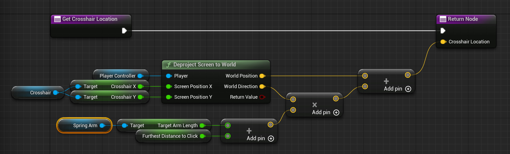

A Line Trace is a type of overlap query.
It tells you what things exist in the world along a line.

A Line Trace takes a start position and an end position, and optionally a radius.

The **Start Position** is often either
- a position on the currently possessed [[Pawn]].
- a screen coordinate deprojected to the world. e.g. a cross-hair in a HUD.
- the mouse cursor position deprojected to the world.

To get a position from the [[Pawn]] use Get World Location,
or if the ray start position is dictated by a Component use Get Component World Location.

# Line Trace By

A Line Trace is done "by" something.
This something can be `Channel`, CONTINUE HERE

# Line Trace From HUD Crosshair

To get the world location of a crosshair in a HUD pass the screen coordinate in pixels to Player Controller > Deproject Screen To World.
If you have a third-person game then you may need to take the spring arm length into account when computing how far the line trace should go.
In the following image Crosshair is a [[HUD]] Blueprint containing a `Crosshair X` and a `Crosshair Y` variable holding the screen coordinate, in pixels, of a crosshair.

To get the mouse cursor position `CONTINUE HERE`
