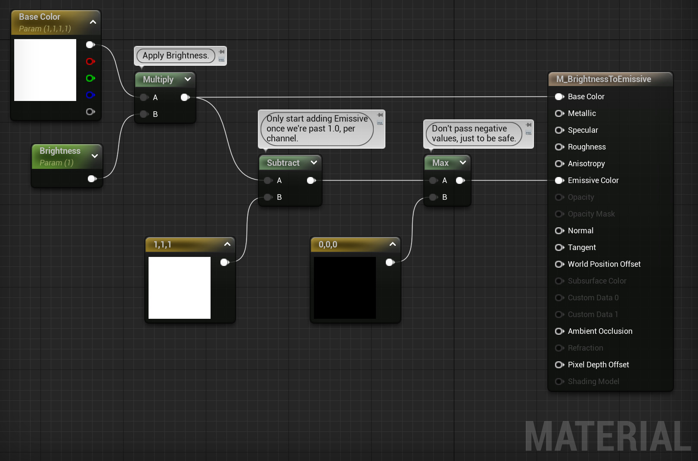

# Texture Sampling

Use a **TexCoord** node, called Texture Coordinate in the library, to zoom in or out of a texture.
Set U- and V Tiling larger than 1 to zoom out, make the pattern smaller, repeat more.
Set U- and V Tiling smaller than 1 to zoom in, make the pattern larger, fewer repetitions.

**Absolute World Position** can be used to get world aligned textures.
Use a Mask node with R and G checked to get only the X and Y coordinates.
Multiply or divide the resulting 2D vector to control tiling.
Pass the 2D vector to a Texture Sample node.
You can use different mask settings to get different projection directions.
Possibly also combine with **VertexNormalWS**, WS stands for World Space, to pick or blend between projection directions.
There is also the  **World Aligned Normal** node, which seems related.
One can also mask out only the Z component of Vertex Normal WS and use that to lerp between two textures.

# Static Switching

A static switch is kind of like a preprocessor `#if` in C++.
It is a configuration point in a [[Master Material]] that a [[Material Instance]] can use to enable or disable parts of the graph.
Called Static Switch Parameter in the node list.
A static switch has two inputs, one labeled True and on labeled false, and one output.
Depending on the value set my the [[Material Instance]] either the True-value or the False value is evaluated and propagated.
The other path is not evaluated.
[[Material Parameter|Material Parameters]] that only connect to static switches along a path that a particular [[Material Instance]] doesn't evaluate will not be listed in the [[Material Instance]].
The static switch node can propagate any data type.

A static switch must always have something connected to both inputs.
This means that we lose the ability to use the engine defaults for the [[Material Output Node]] when there is at least one path that provide a value.
I don't know how to work around this, other than knowing what the default is and creating a constant node with the  same value.
Or creating a [[Material Parameter]] for it an letting someone else pick a value.

# Material Attributes

**Material Attributes** is a pack / struct of everything that a [[Material]] can output.
They are a way to pass around and operate on material data.
Useful for things like layers and blending.
Given a Material Attributes instance we can read individual members of that instance with a Get Material Attributes node.
List the things you need to read in Details panel > Material Attributes > Attribute Get Types.
There is an analogous node for setting, named Set Material Attributes.

Sometimes the **Object Bounds** is useful in [[Material]] calculations.

# Normal Intensity

The normal intensity trick let us control the scale of the normals on our objects.
We get a slider where we can control the smoothness of the surface.
We are basically interpolating between the source normal, such as from a normal map, and the neutral Z normal.
Use a Lerp node to do the interpolation and a scalar [[Material Parameter]] (Hold S on the keyboard and click.) and connect to Lerp.Alpha to control the intensity.
(
Is this really it?
This this actually work?
Lerp won't do a rotation, will it? This will just sort of squish the normal?
)

# Color Tint

We create a color tint by multiplying the Base Color of the [[Material]] with another color.
Create a constant 3 vector (Hold 3 on the keyboard and click.) and multiply (Hold M on the keyboard and click.) it with the Base Color.
Convert the constant 3 vector to a [[Material Parameter]].
Make the default value white, (1.0, 1.0, 1.0), that will make the multiply a no-op.

A separate [[Texture]] can be used to control which parts of the mesh is affected by the color tint.
Options:
- Make the [[Texture]] a binary value and use a Select node to either pick the tint-multiplied base color or just the base color. Make sure the [[Texture Compression]] settings are set to Masks and [[sRGB]] is disabled in the [[Texture Editor]].
- Make the texture a scalar value and [[Lerp]] between the tint-multiplied base color and the base color as-is. Then you can have gradients in the tinting.

By having multiple channels in the texture you can have multiple tint values for different parts of the mesh.
Or you can do some math on the single-channel grayscale texture values to map different ranges in the grayscale to different tint parameters.

We can make **color variations** by having a gray-scale texture for patterns and using a **Blend Overlay** node along with a color parameter to chose a hue.

# Saturation

A saturation control is created by Lerp-ing the Base Color with a black-and-white version of itself.
Create a Lerp node and a scalar [[Material Parameter]] node (Hold S on the keyboard and click.) and connect the parameter to Lerp.Alpha.
Connect the color to saturate to Lerp.B.
There are several ways to create a black-and-white version of the input color.
One is to take a representative color channel and just ignore the other two.

# Brightness

A brightness control is created by multiplying the Base Color with a scalar [[Material Parameter]] (Hold S on the keyboard and click.).
If you want to take this one step further then you can start piping the color into [[Emissive Material|Emissive]] once the brightness parameter goes above 1.0.

## Linear Interpolate (lerp)

Create a Lerp node by holding L on the keyboard and clicking in the [[Material Graph]].
Lerp is used to mix two values or colors.
The Alpha value controls how much of each input to mix into the result.
Alpha = 0 will use the A input value as-is.
Alpha = 1 will use the B input value as-is.
Alpha close to 0 will result in mostly the A value but some of the B value.
Alpha close to 1 will result in mostly the B value but some of the A value.
The value passed to Alpha must be a scalar value, not an RGB value.

# References

- [_Material Editor Fundamentals for Game Development_ by Epic Games, Lincoln Hughes @ dev.epicgames.com 2021](https://dev.epicgames.com/community/learning/courses/pm/unreal-engine-material-editor-fundamentals-for-game-development/)
- [_Materials Master Learning_ > _Material Editor Intro and Learning Strategies_ and the following videos by Epic Games, Sjoerd de Jong @ dev.epicgames.com 2019](https://dev.epicgames.com/community/learning/courses/2dy/unreal-engine-materials-master-learning/oVv/material-editor-intro-and-learning-strategies)
- [_An In-Depth Look at Environment Artist Based Tools_ > _Controlling and Masking Base Color_ by Epic Online Learning @ dev.epicgames.com/courses 2021 UE4.27](https://dev.epicgames.com/community/learning/courses/3G/unreal-engine-an-in-depth-look-at-environment-artist-based-tools/y07/unreal-engine-controlling-and-masking-base-color)
