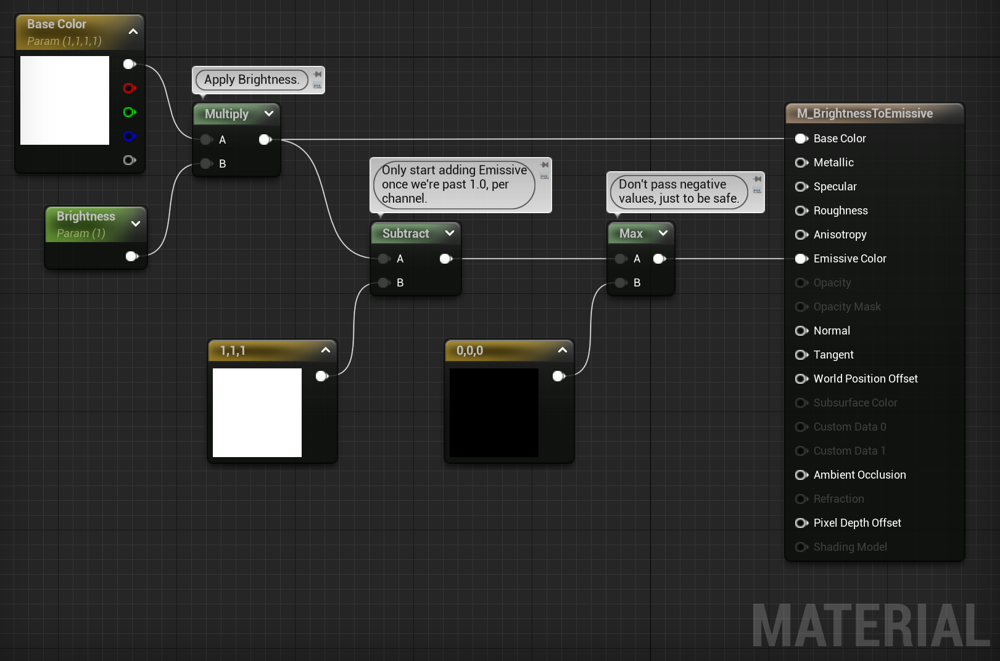

Use a **TexCoord** node, called Texture Coordinate in the library, to zoom in or out of a texture.
Set U- and V Tiling larger than 1 to zoom out, make the pattern smaller, repeat more.
Set U- and V Tiling smaller than 1 to zoom in, make the pattern larger, fewer repetitions.

**Absolute World Position** can be used to get world aligned textures.
Use a Mask node with R and G checked to get only the X and Y coordinates.
Multiply or divide the resulting 2D vector to control tiling.
Pass the 2D vector to a Texture Sample node.
You can use different mask settings to get different projection directions.
Possibly also combine with **VertexNormalWS**, WS stands for World Space, to pick or blend between projection directions.
There is also the  **World Aligned Normal** node, which seems related.
One can also mask out only the Z component of Vertex Normal WS and use that to lerp between two textures.

We can make **color variations** by having a gray-scale texture for patterns and using a **Blend Overlay** node along with a color parameter to chose a hue.

**Material Attributes** is a pack / struct of everything that a [[Material]] can output.
They are a way to pass around and operate on material data.
Useful for things like layers and blending.
Given a Material Attributes instance we can read individual members of that instance with a Get Material Attributes node.
List the things you need to read in Details panel > Material Attributes > Attribute Get Types.
There is an analogous node for setting, named Set Material Attributes.

Sometimes the **Object Bounds** is useful in [[Material]] calculations.

# Normal Intensity

The normal intensity trick let us control the scale of the normals on our objects.
We get a slider where we can control the smoothness of the surface.
We are basically interpolating between the source normal, such as from a normal map, and the neutral Z normal.
Use a Lerp node to do the interpolation and a scalar [[Material Parameter]] (Hold S on the keyboard and click.) and connect to Lerp.Alpha to control the intensity.
(
Is this really it?
This this actually work?
Lerp won't do a rotation, will it? This will just sort of squish the normal?
)

# Color Tint

We create a color tint by multiplying the Base Color of the [[Material]] with another color.
Create a constant 3 vector (Hold 3 on the keyboard and click.) and multiply (Hold M on the keyboard and click.) it with the Base Color.
Convert the constant 3 vector to a parameter.
Make the default value white, (1.0, 1.0, 1.0), that will make the multiply a no-op.

# Saturation

A saturation control is created by Lerp-ing the Base Color with a black-and-white version of itself.
Create a Lerp node and a scalar [[Material Parameter]] node (Hold S on the keyboard and click.) and connect the parameter to Lerp.Alpha.
Connect the color to saturate to Lerp.B.
There are several ways to create a black-and-white version of the input color.
One is to take a representative color channel and just ignore the other two.

# Brightness

A brightness control is created by multiplying the Base Color with a scalar [[Material Parameter]] (Hold S on the keyboard and click.).
If you want to take this one step further then you can start piping the color into [[Emissive Materials|Emissive]] once the brightness parameter goes above 1.0.

