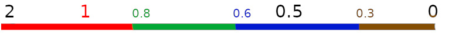

Mesh LOD means that there are multiple versions of a [[Static Mesh]] (or [[Skeletal Mesh]]?) of varying complexity and depending on the distance or size on screen the renderer selects an appropriate version.
The purpose is to improve performance by not rendering more detail than necessary, which is important for [[Static Mesh Performance]].
Unreal uses screen size to pick the LOD level to use.
[[Nanite]], the new mesh management system introduce with Unreal Engine 5, replaces the LOD system described here.

LOD levels are either generated in a [[DCC]] software, such as Blender, and imported to Unreal, or generated from within Unreal Editor.
See _LOD Generation_ below.

# LOD Levels

We can see the LOD levels available to a [[Static Mesh]] in the [[Static Mesh Editor]], in Details panel > LOD Picker > LOD or the LOD selector drop-down button in the top-left corner of the viewport.
The **transition point**, when to switch between LOD levels, is set by selecting a LOD level with the LOD Picker and then editing **Screen Size** in Details panel > LOD # (the LOD level picked) > Screen Size.
Not sure if this is the upper or lower bound, i.e. if this is the point when it switches to this LOD when moving towards or away from the mesh.
LOD levels with a higher number in their name should have a smaller Screen Size value than LOD levels with a smaller number, you can think of the number as a distance from the [[Camera]].
Small number means short distance means large screen size means many triangles.
Large number means long distance means small screen size means few triangles.
The source mesh is typically LOD 0, but we can modify LOD 0 just like any other LOD level, see _Tweaking LOD Level Settings_ below, the source triangle will still be available to the editor.
Screen Size will be write-protected if Details panel > LOD Settings > Auto Compute LOD Distances is checked.
We can set Details > LOD Settings > Minimum LOD to limit how detailed LOD version a particular [[Static Mesh Asset]] will use.
This is useful to improve performance at the cost of some geometry quality.

We can force a particular [[Static Mesh Component]] to use a particular LOD level with Details panel > LOD > Forced LOD Model.

There is a [[View Mode]] named Level Of Detail Coloration > Mesh LOD Coloration, that shows the currently selected LOD level for each [[Static Mesh]] in the level.

Each LOD level has its own set of [[Material Slot|Material Slots]].
If possible, reduce the number of [[Material|Materials]] as the LOD level increases.
See _Tweaking LOD Level Settings_ below.


# LOD Preview

The [[Static Mesh]] is shown in a viewport in the [[Static Mesh Editor]].
The current LOD level and some statistics about it is shown in the upper-left corner of the viewport.
Moving the camera back and forth, by holding the right mouse button (I think.), will let you see at which size the switch between LOD levels happen and what the transition looks like.
To see a fixed LOD level regardless of screen size select the LOD level to see in Details panel > LOD Picker > LOD, or the LOD drop-down button in the top-left corner of the viewport.
The selected LOD level will be shown in the viewport regardless of camera position.
To set it back to automatic switching select LOD Auto.
This setting does not affect regular rendering in the [[Level Viewport]] or a packaged game.

# LOD Generation

All of these settings are in [[Static Mesh Editor]] > Details panel.

## Automatic LOD generation - LOD Group

Set in LOD Settings > LOD Group.
Select the group that best matches the type and usage of your [[Static Mesh]].
It will set some (or all?) of the settings in the LOD Settings category in the Details panel to a preset for that LOD group.
In particular it sets the number of LOD levels that will be generated and the distances at which switching between different LOD levels will happen.
These preset settings can be tweaked before running the LOD generation.
A number of LOD levels will be generated from the source mesh, which becomes LOD 0.

After generating LODs you can use the LOD selector in the top-left corner of the viewport or at [[Details Panel]] > LOD Picker > LOD to inspect the generated LOD levels.
You can also set it to LOD Auto and move the camera back-and-forth to see transition points.
Look at the stats in the top-left corner of the viewport to see when a transition happens and to which LOD level.

You can tweak the settings for and regenerate a specific LOD level from the [[Details Panel]] > LOD # categories and then click Apply Changes in the same [[Details Panel]] category to see the mesh with the new settings in the viewport.
See _Tweaking LOD Level Settings_ below for more information.

## Automatic LOD Generation - Manual Settings

To have more control over the automatic LOG generation set LOD Settings > LOD Group to None.
Set LOD Settings > Number Of LODs to the number of LOD levels you want to have, including LOD 0 for the source mesh, so LOD 0 to LOD \#-1.
Disable LOD Settings > Auto Compute LOD Distances.
Click LOD Settings > Apply Changes.
Unreal will now generate the LOD levels for us.

## Tweaking LOD Level Settings

There are a few per-LOD level settings that we can tweak.
Enable LOD Picker > Custom and select all LOD# check boxes that appear.
This will display the per-LOD level settings for all levels as separate categories in the [[Details Panel]].
These settings include a Screen Size property as a fractions of the entire screen.
Not sure if area, horizontal, or vertical size.
You can also control the amount of triangles generated for each LOD level in the LOD # > Reduction Settings property group, in particular Percent Triangles.

Click LOD Settings > Apply Changes to generate the new LOD levels.

You can add or remove [[Material Slot|Material Slots]] per LOD level.
It is good for performance to keep the number of [[Material|Materials]] per [[Static Mesh]] low,
especially for the more coarse LOD levels.
The [[Material Slot|Material Slots]] are shown in two places in the [[Details Panel]]:
- Material Slots
- LOD # > Sections

To add or remove [[Material Slot]] from a LOD level select the LOD level in [[Details Panel]] > LOD Picker  > LOD and then I guess we should do something in the Sections category. Not sure what though.


## Restoring Imported LOD Levels

If the source asset that was imported to Unreal had LOD levels built in then we can recover them from [[Details Panel]] > LOD Settings > LOD Import > Reimport LOD Level #.

# LOD Transition Distances

Unreal Engine uses screen size to determine which LOD level to use for a [[Static Mesh]].
The [[Static Mesh Editor]] viewport display the current screen size in the top-left corner.
The screen size is a fraction of the entire screen.
A mesh that has screen size 1.0 fills the entire screen.
A mesh that has screen size 0.5 fills half the screen.
A mesh that has a screen size larger than 1.0 extends outside of the screen boundaries.

We can let Unreal Editor pick these screen sizes for us by enabling [[Details Panel]] > LOD Settings > Auto Compute LOD Distances.
We can set these screen sizes manually by disabling Auto Compute LOD Distances, select a LOD level to edit with [[Details Panel]] > LOD Picker > LOD, and under LOD # set Screen Size.
Higher LOD levels, i.e. levels with fewer triangles, should have smaller screen sizes.
The set screen size is the largest screen size at which the LOD level will be used.
If the screen size is a little bit larger, then the next lower LOD level, i.e. the one with more triangles, will be used instead.

The following image demonstrates which LOD level is being used at different screen sizes.
The LOD levels are visualized as colors and the colored numbers are the screen size set for that LOD level.
- LOD 0: Red, screen size 1.0
- LOD 1: Green, screen size 0.8
- LOD 2: Blue, screen size 0.6
- LOD 3: Brown, screen size 0.3

Starting with the camera very close to the mesh we get a large screen size and the red LOD 0 is picked.
Pulling the camera away from the mesh causes the screen size to decrease.
LOD 0, red, will be used  until the screen size is reduced to 0.8, the screen size set for LOD 1, green.
At this point the green LOD level is used instead.
Pulling away further we eventually reach a screen size of 0.6, at which point the blue LOD 2 is used instead.
And lastly at 0.3 the brown LOD 3 is used.
In this diagram LOD 3 would be used even when the mesh is infinitesimally small.
At that point we shouldn't render the mesh at all.
See _Distance Culling_ below.



We can visualize the transitions in the [[Static Mesh Editor]] viewport by setting the LOD picker to LOD Auto and moving the camera closer or further away from the mesh.
The current LOD level and screen size is shown in the top-left corner of the viewport.


# Distance Culling

The most extreme form of LOD is to not render a mesh at all.
This can be done for a [[Static Mesh Component]] with Details panel > LOD > **Desired Max Draw Distance**.
When the mesh if further from the camera then this then it won't be rendered.
It's "desired" because the distance can be set by other things as well, such as a Cull Distance Volume (I think.).
A mesh can also be prevented from rendering by setting Details panel > LOD > **Detail Mode**.
The Detail Mode, one of Low, Medium, High, control at what details settings this mesh should start to be included in.
If detail mode >= system detail mode, then the mesh won't be rendered.
Set small clutter to High, meaning that they are rendered only on High settings, set the important bits to Low, meaning that they are rendered on Low and up.
```
    m e s h
    l  m  h
s l ✓  x  x
y m ✓  ✓  x
s h ✓  ✓  ✓
```


# References

- [_5 Tips to Optimize Environments in Unreal Engine 4_ - LOD by Jakub Haluszczak @ youtube.com 2021](https://youtu.be/gZkKcaF4Ifk?t=150)
- [_Becoming an Environment Artist in Unreal Engine_ > _Polycount, Optimization and Draw Calls_ by Epic Online Learning @ dev.epicgames.com/courses 2020 UE4.25](https://dev.epicgames.com/community/learning/courses/Gm/becoming-an-environment-artist-in-unreal-engine/r2n/unreal-engine-polycount-optimization-and-draw-calls)

