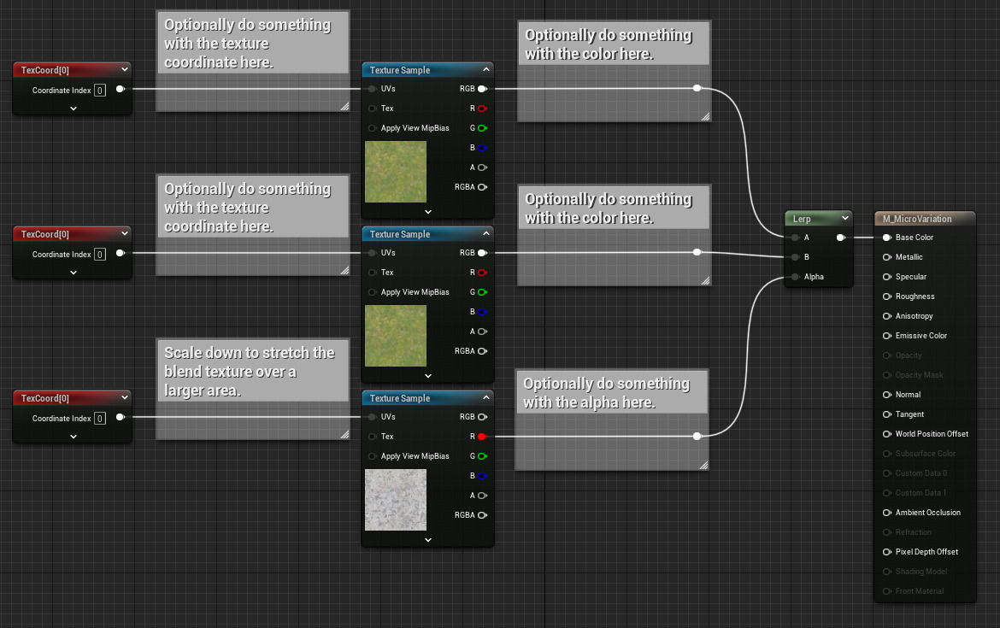
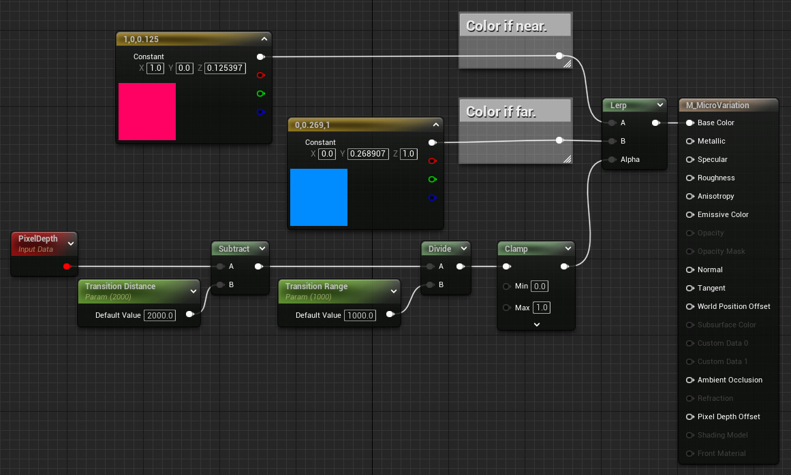
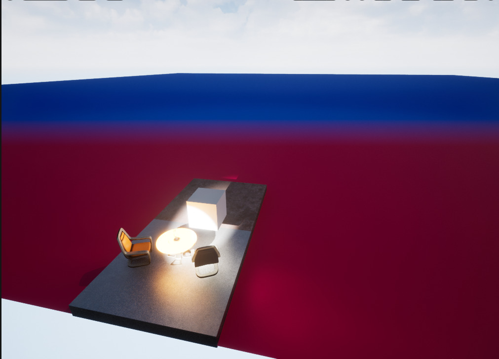

See also [[Breaking up Landscape Texture Tiling]].
See also [[Texture]].

# Seamless Texture

A texture is seamless if there is no obvious  point where the texels wrap around from one side to the other as the texture is tiled over  a surface.
The pattern along the U=1.0 edge should match the pattern along the U=0.0 edge.
And the same for the two V edges.

# Micro Variation

The idea is to use a very stretched noise [[Texture]] as a blend alpha between two variants of the base texture.
The variant can either be two different textures or some manipulation done in the [[Material]].
For example, one can multiply the [[Texture]] sample with a tint parameter, or scale the texture coordinate in different ways.
Whatever is done to achieve the two color values, pass them to a [[Lerp]] node.
The Alpha of the [[Lerp]] node is a sample from a gray-scale [[Texture]] that is usually very "blobby", meaning that it has large area of dark and white sections with smooth transitions.
There are a few textures like this in the [[Starter Content]], such as `T_MacroVariation` and `T_Perlin_Noise_M`, and some in the Engine content.

A similar technique can be used to vary the saturation or other properties of the color.
For example, one can use yet another grayscale noise texture and multiply that with the lerped / blended color before plugging into the Base Color pin.
In this way we can get darker or brighter patches in the texture layered on top of, but spaced differently, the color variations.

# Distance Blend

As the textured object extends into the distance a given distance on screen covers a larger and larger section of the underlying texture.
This makes texture tiling more apparent, despite the blending and variations described above.
We can combat this by using a larger tiling, scaling down the texture coordinate, as the distance to the rendered fragment increases.
We can do this with the Pixel Depth node.
This tells us how far away a fragment is.
We can either using this in the computation of the UVs to the Texture Sample nodes,
or use it  as a basis to blend between a far color and a near color.
When blending, both far and near would be computed as described above, but with different UVs computations to make the near tiling small and the far tiling large.
One can do some math on the Pixel Depth value to produce a [[Lerp]] alpha value that is capped one for a bit near the camera,
then has a transition range to black,
and then remain black into infinity.

# Resources

- [_The Secret to Hide TEXTURE REPETITION in Unreal Engine 5: 4 PRO TIPS - UE5 Tutorial_ by Game Dev Academy @ youtube.com](https://www.youtube.com/watch?v=zY8AtjM2Jxg)

