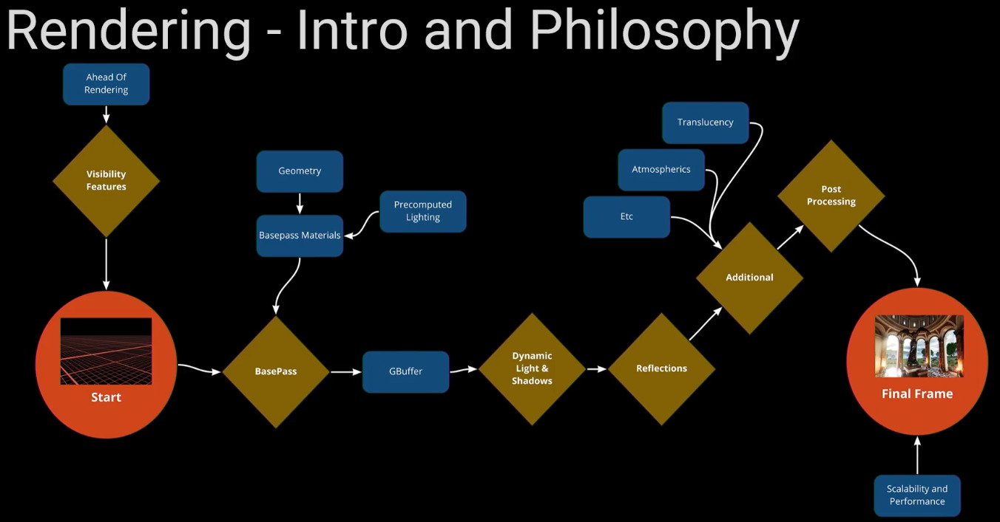

The rendering pipeline is a loop that performs a number of steps per frame.
The steps are pipelined, meaning the different steps are being performed in parallel for multiple frames.
Some of the steps are done on the CPU, some are done on the GPU.

The rendering pipeline is three frames deep, meaning that the pixels on-screen are three frames old.
- Position Updates
	- Physics, animation, gameplay logic, etc.
- [[Occlusion Visibility Process]]
- GPU Rendering
	- [[Early Z Pass]]
	- [[Base Pass]]

# Step 1 - State Update And Change Detection

The first step is to figure out what has changed since the previous frame.
This is done on the CPU.
- Animations.
- Gameplay logic.
- Physics.
- Probably more.

# Step 2 - Visibility And Culling

The second step is to figure out what should be rendered and what should not.
This is called the visibility and [[Culling]] pass.
- [[Distance Culling]]: Set per [[Actor]]. If the Actor is farther than this distance from the camera then it is culled away.
	- The [Begin Play | Rendering](https://dev.epicgames.com/community/learning/tutorials/vyZ1/unreal-engine-begin-play-rendering) talks about volumes here. Not sure what that is.
- [[Frustum Culling]]: Don't render things outside of the visible camera space.
	- Use [[Freeze Rendering]] to see what survives frustum culling. It may be more than you expect, for example due to batching or larger-than-expected meshes.
- Precomputed visibility.
	- Useful if the game only allows for limited mobility of the camera.
	- Precompute what can be seen from a collection of specified locations and angles.
- [[Nanite]] culling.
	- Nanite meshes are culled on the cluster level, which is a patch of triangles suitably sized for the current camera distance, and based on instances.
	- Replaces the other culling methods for Nanite geometry.
- Visibility culling.
	- Don't render things that are behind opaque objects.

See also [[Occlusion Visibility Process]].

# Step 3 - GPU Rendering

After the [[Occlusion Visibility Process]] we end up with a list of things to render.

## Depth Pass

The first pass is the [[Depth Pass]], which populates the [[Depth Buffer]].
This makes it possible to access the [[Scene Depth]] in our [[Material|Materials]], using the Pixel Depth node.
This is useful for many material effects.

The depth buffer is also used by Unreal Engine to avoid overdraw, which improves performance.
Particularly important for foliage heavy scenes.

## Base Pass

Draw the material layers for all non-culled [[Mesh|Meshes]], [[Landscape|Landscapes]], characters, and so on.
If using [[Lightmap|Lightmaps]] generated by [[Static Lighting]] then those are applied during the base pass.

Generates a number of buffers.
- Base color.
- Specular, roughness, metallic.
- World Normal.
- Additional. (Not sure what this is. Custom/user-specified?)

You can visualize the buffers with [[View Mode]] > Buffer Visualization > Overview, or one of the specific buffers in the same menu.

## Dynamic Lighting And Shadow

See [[Dynamic Lighting]] and [[Dynamic Shadows]].

## Reflections

Static reflections are captured with reflection probes.
Captures the static, i.e. not [[Mobility]] = Movable, environment around them.

Dynamic reflections can be done with one of
- Screen space.
	- Fast but can only see things that are visible on screen.
	- Not behind things, not outside the view frustum.
- [[Lumen]].
	- Can use ray-tracing when available.
- Ray-traced.
	- Deprecated, use [[Lumen]] instead.
- Planar reflections.
	- Very costly since it renders the entire scene again from the reflection's angle.

See [[Reflections]].

## Additional Passes

Rendering methods that fall outside of the standard rendering methodology.
- Water.
- Volumetrics like fog and [[Volumetric Cloud]].
	- Clouds are volumetric, meaning they have a volume.
	- You can travel around and through them.
	- There is a [[Volume Material]] to render these types of objects.
- Hair.
- [[Translucency]].

## Post Processing

A number of effects done using only the buffers generated by the prior passes.
Think of them like filters.
Two types of effects:
- Trying to replicate real-world cameras.
	- Bloom
	- [[Depth Of Field]]
	- Lens flare.
	- Chromatic Abberation.
	- Tone mapper.
	- And more.
- Approximations of more complex rendering methods.
	- Screen-space [[Global Illumination]].
	- Sub-surface scattering.
	- Ground-truth [[Ambient Occlusion]].

Created a Post Process Volume from the create menu in the [[Main Tool Bar]].
Can also be set on a [[Camera]].

See [[Post Processing]] and [[Post Process Volume]].

# Rendering Hardware Interface - RHI

Unreal Engine supports multiple rendering APIs:
- DirectX.
- Vulkan.
- OpenGL.
	- Deprecated on desktop.
- Metal.

# Vertex And Pixel Shaders

Many of the steps in the rendering pipeline makes use of shaders.
A [[shader]] is a GPU program that is run in parallel over all vertices or all pixels of a rendered [[Mesh]].
The two most important [[Shader]] types are [[Vertex Shader]] and [[Pixel Shader]].

# References

- [_Graphics Programming Overview_ by Epic Games @ docs.unrealengine.com](https://docs.unrealengine.com/5.0/en-US/graphics-programming-overview-for-unreal-engine/)
- [_Begin Play | Rendering_ by Epic Games @ dev.epicgames.com 2022](https://dev.epicgames.com/community/learning/tutorials/vyZ1/unreal-engine-begin-play-rendering)
- [_Materials Master Learning_ > _Architecture_ by Epic Games, Sjoerd de Jong @ dev.epicgames.com 2019](https://dev.epicgames.com/community/learning/courses/2dy/unreal-engine-materials-master-learning/oJjW/unreal-engine-performance)

