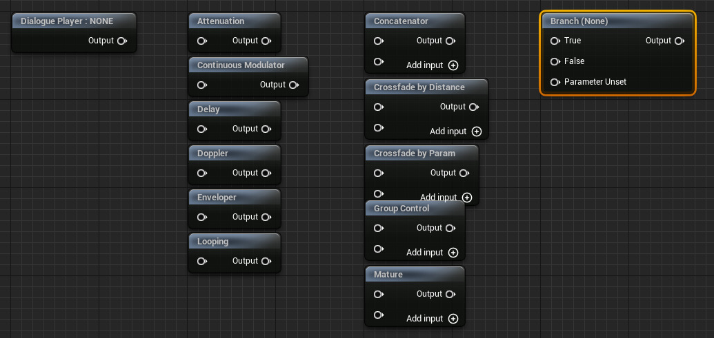

This note outlines how the [[Sound Cue Editor]] has been implemented.
I'm not allowed to show much of the Unreal Engine code due to licensing restrictions,
but I can at least given an overview of the class relationships.
This analysis was done on Unreal Engine 5.1.1.
See also [[Custom Node Graph Editor]] for a description of the node graph editor system.
See also [[Node Graph Editor]] for an overview of the engine classes that make up the node graph editor toolkit.

Here is a screenshot of the [[Sound Cue Editor]], where a sound cue [[Asset]] is being edited.
![[Images/Sound_cue_graph.png]]

We see three tabs:
- Details panel
- Viewport
- Palette

The main focus of this note is the Viewport.


The implementation consists of the following header files:
- `SoundCue.h`
	- Contains `USoundCue`, which is an `UObject`. Is an [[Asset]].
	- Contains `ISoundCueAudioEditor`, an interface class.
- `SoundCueFactoryNew.h`
	- Contains `USoundCueFactoryNew`, which is an `UFactory`.
- `SoundCueGraph.h`
	- Contains `USoundCueGraph`, which is an `UEdGraph`.
- `SoundCueGraphNode_Base.h`
	- Contains `USoundCueGraphNode_Base`, which is an `UEdGraphNode`.
- `SoundCueGraphNode.h`
	- Contains `USoundCueGraphNode`, which is an `USoundCueGraphNode_Base`.
- `SoundCueGraphSchema.h`
	- Contains a bunch of  subclasses of `FEdGraphSchemaAction`.
	- Contains `USoundCueGraphSchema`, which is an `UEdGraphSchema`.
- `SoundCueGraphNode_Root.h`
	- Contains `USoundCueGraphNode_Root`, which is an `USoundCueGraphNode_Base`.
- `SoundCueEditor.h`
	- Contains `FSoundCueEditor`, which implements `ISoundCueEditor`.
- `SoundCueGraphNodeFactory.h`
	- Contains `FSoundCueGraphNodeFactory`, which is a `FGraphPanelNodeFactory`.
- `SoundCueGraphEditorCommands.h`
	- Contains `FSoundCueGraphEditorCommands`, which is a `TCommands`.
- `SoundCueEditorUtilities.h`
	- Contains `FSoundCueEditorUtilities`, which is a bunch of functions.
- `SoundNode.h`
	- Contains `USoundNode`, which is an `UObject`.
- `SoundCueGraphConnectionDrawingPolicy.h`
	- Contains colors and wire thickness data.


Stuff I don't know what it is yet:
- `FGraphPanelPinConnectionFactory`
	- Inherited from by `FSoundCueGraphConnectionDrawingPolicyFactory`
- `FConnectionDrawingPolicy`
	- Inherited from by `FSoundCueGraphConnectionDrawingPolicy`

# Classes

## `USoundCue`

Defined in `SoundCue.h`.
A Runtime class.
Inherits from `UObject`.
Is an [[Asset]], meaning that is has a corresponding `UFactory` and `FAssetTypeActions_Base`.
Contains a list of `USoundNode`.
Has a bunch of [[Property|Properties]] that show up in the [[Details Panel]] in the sound cue editor.
Some of the properties are within `#if WITH_EDITORONLY_DATA` guards and excluded from the [[Details Panel]] by not having a [[Property Specifier]].

Has an `UEdGraph` member variable named `SoundCueGraph`.
Always points to a `USoundCueGraph`.
Is initialized in `PostInitProperties`.
Creation goes via `ISoundCueAudioEditor`.
`ISoundCueAudioEditor` is a singleton class, static member variable.
The instance is created by `USoundCueGraph`  once.

Has function `ConstructSoundNode`.
Has a bunch of `WITH_EDITOR` functions dealing with the `UEdGraph` and `ISoundCueAudioEditor`.


## `USoundCueFactoryNew`

Defined in `SoundCueFactoryNew.h`.
An Editor class.
Inherits from `UFactory`.
Create new `USoundCue` instances in `FactoryCreateNew` using `NewObject<USoundCue>`.


## `FAssetTypeActions_SoundCue`

Defined in `AssetTypeActions_SoundCue`.
Is an Editor class.
Inherits from `FAssetTypeActions_Base`.

Opens the asset editor for a`USoundCue`.
Does this via `IAudioEditorModule`, by calling `IAudioEditorModule::CreateSoundCueEditor`.
Allocates a new `FSoundCueEditor`.


## `USoundNode`

Defined in `SoundNode.h`.
A Runtime class.
Inherits from `UObject`.
Has a list of `USoundNode` subclasses.
Has an `UEdGraphNode`, which only points to `USoundCueGraphNode`. (I assume.)
Declares a bunch of virtual functions.

Has a maximum number of child nodes.
Is there a 1:1 relationship between child nodes and output pins,  or can multiple child nodes be connected to a single output pin?

The sound effects that can be added to a `USoundCue` are all subclasses of `USoundNode`.
For example `USoundNodeDoppler` and `USoundNodeDelay`.


## `ISoundCueAudioEditor`

Defined in `SoundCue.h`.
A Runtime class.
Contains a bunch of pure-virtual functions for manipulating sound and graph nodes.
I would like to have this class be named `ISoundCueGraphEditor`.


## `USoundCueGraph`

Defined in `SoundCueGraph.h`.
An Editor class.
Inherits from `UEdGraph`.
A very small class.
Overrides no virtual functions.
Has a single function: `USoundCue* GetSoundCue()`.
Returns the `USoundCue` this graph has been created for.

Hidden in the `.cpp` file is `FSoundCueAudioEditor`, which inherits from `ISoundCueAudioEditor`.
That is the interface class defined in `SoundCue.h`.
`FSoundCueAudioEditor` is a singleton, created by the first `USoundCueGraph` constructor call.
`USoundCue` asks `FSoundCueAudioEditor`, the singleton, to create a `USoundCueGraph` for it in `PostInitProperties`.
So every `USoundCue` has a `USoundCueGraph` at all times, ready to be shown in a `FSoundCueEditor`.


## `USoundCueGraphNode_Base`

Defined in `SoundCueGraphNode_Base.h`.
An Editor class.
Inherits from `UEdGraphNode`.
Has a bunch of pin-related functions.


## `USoundCueGraphNode`

Defined in `SoundCueGraphNode.h`.
An Editor class.
Inherits from `USoundCueGraphNode_Base`.
Has a pointer to `USoundNode`.
Has a bunch of pin-related functions.


## `USoundCueGraphNode_Root`

Defined in `SoundCueGraphNode_Root.h`.
An Editor class.
Inherits from `USoundCueGraphNode_Base`.
I think this is the output node.


## `USoundCueGraphSchema`

Defined in `SoundCueGraphSchema.h`.
An Editor class.
Inherits from `UEdGraphSchema`.
Has a bunch of link related functions.
Manages a bunch of actions, subclasses of `FEdGraphSchemaAction`.
The `FEdGraphSchemaAction` subclasses are used by `FSoundCueEditor`.


## `FSoundCueGraphNodeFactory`

Defined in `SoundCueGraphNodeFactory.h`.
An Editor class.
Inherits from `FGraphPanelNodeFactory`.
Creates a `SGraphNode` from a `UEdGraphNode`.
Always creates a `SGraphNodeSoundBase` for all types of `USoundCueGraphNode`.
`USoundCueGraphNode_Root` get a `SGraphNodeSoundResult`.


## `FSoundCueGraphEditorCommands`

Defined in `SoundCueGraphEditorCommands.h`.
An Editor class.
Inherits from `TCommands`.
Contains a bunch of `FUICommandInfo` for a number of things that the user can do.

It is not clear to me what types of actions/commands goes into `FSoundCueEditorCommands` and what types goes into `FEdGraphSchemaAction`.


## `FSoundCueEditorUtilities`

Defined in `SoundCueEditorUtilities.h`.
An Editor class.
Various helper functions.

`GetSelectedNodes` is used by `FSoundCueGraphSchemaAction_NewNode::ConnectToSelectedNodes`.


## `IAudioEditorModule`

Defined in `AudioEditorModule.h`.
An Editor class.
Extends `IModuleInterface`.
Declares a bunch of sound related functions.


## `FAudioEditorModule`

Defined in `AudioEditorModule.cpp`.
An Editor class.
Implements `IAudioEditorModule`.
Passed to `IMPLEMENT_MODULE`.

Has `CreateSoundCueEditor`, which creates an `FSoundCueEditor` for a particular `USoundCue`.


## `FSoundCueEditor`

Defined in `SoundCueEditor.h`.
An Editor class.
Inherits from `ISoundCueEditor` and a few utility classes.
Has a bunch of node related functions.
Has a `USoundCue`, `SGraphEditor`, and tabs with Details panel and Palette.
This is the main editor window for a sound cue asset.
Is created by `FAssetTypeActions_SoundCue::OpenAssetEditor`,
with some help from `IAudioEditorModule::CreateSoundCueEditor`.


## `ISoundCueEditor`

Defined in `ISoundCueEditor.h`.
Is an Editor class.
Inherits from `FAssetEditorToolkit`.
Weird that an `I-` class inherits from an `F-` class.

The documentation for `FAssetEditorToolkit` says:

> Base class for toolkits that are used for asset editing.


## `SSdoundCuePalette`

Defined in `SSoundCuePalette.h`.
Is an Editor class.
Inherits from `SGraphPalette`.
Is a really small class, just a single function named `CollectActions`.


## `FGraphNodeCreator`


## `UEdGraphPin`

## `SGraphNodeSoundBase`

Defined in `SGraphNodeSoundResult.h`
I don't see any child classes of this, so not sure why it's called `-Base`.

This one does Slate stuff, as indicated by the `S` prefix on the class name.


## `SGraphNodeSoundResult`

Defined in `SGraphNodeSoundBase.h`.


# Number Of Pins

The various Sound Cue graph nodes support varying number of input pins.
Here is a screenshot of some examples of zero, one, two, and three input pins.
Some have an Add Input button, i.e. support variable number of input pins.

There is always exactly one output pin, except for the output node that has no output pin.


## Input Pin Creation

Pins are part of `USoundCueGraphNode_Base` inherited from `UEdGraphNode`, both Editor types.
They mirror the `ChildNodes` or `USoundCueNode`, the Runtime type.

Input pins are created when a new graph node is created.
Graph nodes can be created from the graph right-click context menu, which lists all the node types.
This context menu is filled in by the following callstack:
- `EdGraphSchema`, or something that knows `UEdGraphSchema`, such as `UEdGraph`.
- `USoundCueGraphSchema::GetGraphContextActions`, part of a base class interface.
- `USoundCueGraphSchema::GetAllSoundNodeActions`
- `new FSoundCueGraphSchemaAction_NewNode(SoundNodeClass)`, called in a loop.

Then the user right-clicks the graph and selects one of the sound node types:
- `FSoundCueGraphSchemaAction_NewNode::PerformAction`
- `USoundCue::ConstructSoundNode(SoundNodeClass)`
- `USoundCue::SetupSoundNode`
- `FSoundCueAudioEditor::SetupSoundNode`
- `FGraphNodeCreator::Finalize`, non-sound-specific editor code.
- If no pins yet:
	- `USoundCueGraphNode_Base::AllocateDefaultPins`
	- `virtual CreateInputPins()`
	- `USoundCueGraphNode::CreateInputPins`
	- `for each USoundNode::ChildNodes:`  Will this ever be non-empty? [1]
	- `CreateInputPin()`
	- `UEdGraphNode::CreatePin(EGPD_Input, ...)`, non-sound-specific editor code.

[1] I believe `USoundNode::ChildNodes` is filled in after `AllocateDefaultPins`.
`AllocateDefaultPins` is called from `USoundCue::ConstructSoundNode`.
`FSoundCueGraphSchemaAction_NewNode::PerformAction` has:
```cpp
USoundNode* NewNode =
	SoundCue->ConstructSoundNode<USoundNode>(
		SoundNodeClass, bSelectNewNode);
if (NewNode->GetMaxChildNodes() > 0
	&& NewNode->ChildNodes.Num() == 0)
{
	NewNode->CreateStartingConnectors();
}
```

So there will, by default, be one input pin per child node.
So what fills `ChildNodes`?
`USoundNode` probably.
`USoundNode::ChildNodes` is a list of `USoundNode`.
There is a min and a max number of children.
`USoundNode`, the base class, set these to 0 and 1, respectively.
`USoundNode::ChildNodes` can contain `nullptr` elements.
Child nodes are created at
- `USoundNode::CreateStartingConnectors` creates `GetMinChildNodes` child nodes.
- `USoundNode::InsertChildNode`
- `TArray<USoundNode*> InsertZeroed`
- `FSoundCueAudioEditor::CreateInputPin`
- `USoundCueGraphNode::CreateInputPin`
- `UEdGraphNode::CreatePin(EGPD_Input,...`

What is the relationship between `AllocateDefaultPins` and `CreateStartingConnectors`?
`FSoundCueGraphSchemaAction_NewNode::PerformAction` calls
- `USoundCue::ConstructSoundNode`
- `USoundNode::CreateStartingConnectors` if `USoundNode::ChildNodes` is empty.

So we only get to `USoundNode::CreateStartingConnectors` if no children has been created so far.
And I don't think any has.
`AllocateDefaultPins` also loops over `USoundNode::ChildNodes`.
`USoundNode::ChildNodes` is filled by `USoundNode::CreateStartingConnectors`.


We can set a label on a pin with
```cpp
NewPin->PinName = CreateUniquePinName(TEXT("Input")); /* Not visible. */
NewPin->PinFriendlyName = FText::FromString(TEXT(" ")); /* Visible. */
```

Let's see how a few nodes configure themselves.
The control knobs they have are:
- `virtual USoundNode::GetMaxChildNodes`
	- Default: `1`
- `virtual USoundNode::GetMinChildNodes`
	- Default: `0`
- `virtual USoundNode::CreateStartingConnectors`
	- Default: Create `GetMinChildNodes` child nodes, but at last `1`, but never more than `GetMaxChildNodes`.


### `USoundNodeDialoguePlayer`

Overrides `GetMaxChildNodes`: `0`.

So, since the default `CreateStartingConnectors` cap at max, no child nodes will be created.


### `USoundNodeAttenuation`

Does not override anything, so get `1` child node.


### `USoundNodeConcatenator`

Overrides `GetMaxChildNodes`: `MAX_ALLOWED_CHILD_NODES` (`32`)
Overrides `CreateStartingConnectors`: Calls `USoundNode::InsertChildNode` twice.
Overrides `(Insert|Remove)ChildNode`: To keep `InputVolume` in sync. Call base implementation.

This one has an `Add Input` button.
What creates that?
It seems `SGraphNode` is aware of the `Add Input` button.
`SGraphNodeSoundBase : SGraphNode` overrides `IsAddPinButtonVisible`.
Asks `USoundCueGraphNode::CanAddInputPin`.
A non-`virtual` member function of `USoundCueGraphNode`.
`USoundCueGraphNode::CanAddInputPin` does
- `USoundNode::ChildNodes::Num < SoundNode::GetMaxChildNodes`.


## Input Pin To Child Node Synchronization

When the user modifies the graph in the graph editor the `USoundNode` instances' `ChildNodes` list are updated by `FSoundCueAudioEditor::CompileSoundNodesFromGraphNodes`.

