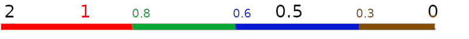

The Static Mesh Editor is where we can configure settings for our [[Static Mesh Asset]].
It is not an editor for the triangles itself, the topology of the mesh.
It is an editor for how Unreal Engine uses and renders the mesh.

# Main Tool Bar

Reimport Base Mesh uses the source asset path stored in the [[Static Mesh Asset]] and imports it again,
throwing away the old triangles and replacing them with the new ones.
The file location Unreal Editor searches then reimporting can be changed at [[Details Panel]] > Import Settings > File Path > Source File.

# LOD Settings

Where the settings for [[Mesh LOD]] is set.
See [[Mesh LOD]] for more information.

## LOD Transition Points

Unreal Engine uses a screen-size based system to determine which LOD level to display.
As opposed to a distance based system.
The transition points can be automatic, in which case Details panel > LOD Settings > Auto Compute LOD Distances is enabled.
If this is disabled then you can
- Select a LOD in Details panel > LOD Picker > LOD to enable that LOD level's category in the Details panel.
	- Or enable the Custom checkbox below it to enable an arbitrary selection of LOD # categories in the Details panel.
- Set Details panel > LOD # > Sections > Screen Size to a screen fraction where this LOD level should become active.

The screen fraction we set is the size at which we will transition to that LOD when moving away from the object.
Or conversely, when moving towards the object it is the size at which we will switch to a higher-resolution LOD level.
The following figure demonstrates at which screen fractions each LOD level is active.
The left hand side of the figure is when we are very close to the object, 2 means that we would need two screens to see the entire object, we can only see half of it on our single screen.
The right hand side of the figure is when the object is very far away.
Each LOD level is given a color and the color of the numbers indicate the configured screen size for that LOD level.
Black number don't correspond to any particular LOD level.
The color of the line show which of the LOD levels is active then the object has the size that corresponds to that point along the number line.
You will have to excuse, or at least look past, the non-linear scale of the number line.

# Shadows

Shadows can be enabled or disabled per [[Static Mesh Asset]] LOD-level in the [[Static Mesh Editor]].
Open your foliage [[Static Mesh Asset]] in the Static Mesh Editor.
In the Details panel there is a LOD Picker category where we can chose to display settings for the LOD levels available in the mesh.
Pick the largest number / farthest LOD from the list.
This enables the Details panel category for that LOD level.
In the Sections group within that category we have a Cast Shadow checkbox, disable that.
This will make that specific LOD not cast any shadow.
Repeat for as many LOD levels up the list as you need.

A bug in Unreal Engine 5.0 makes all instances of that [[Static Mesh Asset]] in the level to be not rendered, reload the level to get them back again.

For lights using [[Shadow Maps]], the [[Lightmap]] settings will effect those shadows.
In particular the Lightmap size.
For more information see [[Lightmap]].
