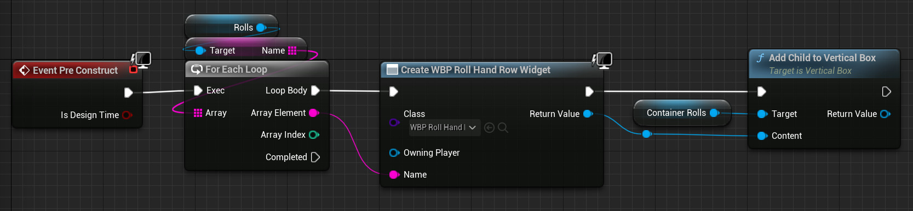

A framework used to render interactive graphical 2D elements on the screen.
Used for user interface elements, heads-up displays, a.k.a. [[HUD]], menu systems, and such.
The 2D elements are called widgets.
Widgets can either display something or contain other widgets in a tree structure.
Widgets that contain other widgets are called container or panel widgets.
Widgets can also contain logic and behavior,
for example to compute a value to show
or to react to input, such as a mouse click, from the player.
The contents and behavior of a widget can be defined in both Blueprint and C++.

# Creating A Blueprint Widget

A widget is a type of [[Asset]] created from the [[Content Browser]].
Widgets are often stored in a folder named `UI` or `Widgets`.
Content Browser > right-click > User Interface > Widget Blueprint.
Widget Blueprint names after prefixed with `WBP_`.
A list of widget types is presented.
The most common type is User Widget.

# Populating A Widget

Widgets are edited in the [[Widget Editor]].
The [[Widget Editor]] lets you create and position the sub-widgets that make up your widget.
There is a library of common widget variants in the Palette panel.
Things like
- Button
- Check Box
- Image
- Progress Bar
- Text
and many more.

Common container widgets are Canvas Panel, Vertical Box, Horizontal Box, and Scroll Box.

The sub-widgets form a hierarchy with a parent-child relationship.
The widget being edited is the root of that hierarchy.
The hierarchy can be seen and edited in the Hierarchy panel.
Add a sub-widget to your widget by dragging it from the Palette panel to either the Hierarchy panel or the Designer panel.

Each widget can be given a name, so that it can be referenced from [[Blueprint Visual Script]] in the Graph mode.
To be accessible the widget must also have the Details panel > Is Variable check box ticked.
Compile the Blueprint.
For some types of widgets, such as Image, this is on by default.
For some types of widgets, such as Text, this is off by default.

# Container Widgets

A container widget contains other widgets.
Each child widget lives inside a slot within the container widget.
When a widget is a child of a container widget then the Details panel for the child has a Slot category.
The Slot category contains things like the size, position, and alignment of the slot, if the parent container supports them.
The child-widget will render differently, and have different Slot properties, depending on the type of container it is put inside.
A Canvas Panel allows for arbitrary positioning and sizing.
A Vertical Box will place all child widgets in a vertical list, the first above the second and so on.
When in a Canvas Panel the Slot category contains a size that was a 2D value,
when in a Vertical Box the Slot category contains a size that is either Auto of Fill, no numbers.
When in a Vertical Box there is no Position property at all because the position is defined by the height of the other widgets in the Vertical Box.
Different container widgets are used for different purposes.

A Blueprint Widget can add new sub-widgets to a container widget using [[Blueprint Visual Script]].
Create the new sub-widget instance with Create Widget and add it to the container widget with Add Child.
Some container widget types have a more specific name for the add function, such as Add Child To Vertical Box.
Example that creates a bunch of Roll Hand Row widgets based on the contents of an array.
The Create node has the Name input because the Roll Hand Row widget type has a [[Blueprint Variable]] named Name that has
- Instance Editable
- Expose On Spawn
enabled.

# Displaying A Widget

A widget can be displayed either on the player's screen, or in the world.

## Player Screen

Since a screen is (usually) tied to a player, creating and displaying the widget should be done by the [[Player Controller]].
This can either be done using the [[HUD]] class, or manually.
If you have other needs then the widget creation can be done elsewhere, for example by the [[Game Mode]] or a [[Pawn]].

Find a suitable [[Event Node]] or function where the widget should be created.
Often Begin Play or [[Possessed]] (Is there such an event?).

A new widget is created with [[Event Graph]] > right-click > User Interface > Create Widget.
Weirdly, the node created when selecting Create Widget is named Construct until a widget type is selected.
For the Class parameter select your widget Blueprint.
Not sure when Owning Player must be provided.
The

After being created the widget instance must be added somewhere to show up.
Often it should be added a [[Viewport]].
It can also be added to a player screen, which is used in split-screen situations.
The widget member function to call in most cases is Add To Viewport.

It is common to store the widget reference as a [[Blueprint Variable]] so that it can be data it displays can be updated later.
Though this creates a hard reference, so consider looking into other means of [[Blueprint Communication]] and [[Soft Reference]].

## In The World

(
TODO Write about Widget Component.
)

# Updating Data

For performance reasons we don't want to update the dynamic UI elements such as health bars and ammo counters every tick.
We only want to update when the underlying data changes.
This is typically done as a [[Custom Event]] per displayed datum to set the new value,
i.e. update the contents of the sub-widget displaying this data.
Game logic in some other class would update the data and then modify the widget either by triggering the [[Custom Event]] directly,
or indirectly by triggering a [[Delegate]] that the widget [[Custom Event]] has been bound to.

Another option is to create a binding for the sub-widget.
A binding is a function that is called by the UMG framework when painting the UI.
This is typically advised against because the bound function is called on every frame,
which is bad for performance.
But it can be good for prototyping since it makes it very easy to, together with e.g. Get Player Character, get dynamic data on screen.
It can also be used for data that do update on every tick, such as a timer
A binding is created by selecting the sub-widget and in the Details panel next to each [[Property]] that supports bindings you will find a Bind drop-down that when clicked reveal a Create Binding option.
Selecting Create Binding creates a new function with a return type matching the type of the [[Property]].

# Widget Types
## Text

Write text to the screen.
The text string is set in Details panel > Content > Text.
The size of the text is not necessarily the same as the size of the text widget,
meaning that the text may overflow the widget bounds.
Some containers support the Size To Content flag for child-widget slots.
Consider enabling that.

The size of the text is set with Details panel > Appearance > Font > Size.

## Image

The Image widget is used to display a texture or a solid color.
The Details panel > Appearance > Brush > Image property is used to set the texture to display.
It is important to match the size of the slot in the container widget, if any, to the size of the texture,
to avoid stretching and non-uniform scaling.
Details panel > Slot > Size To Content may be a good idea.

# References

- [_Your First Hour in UMG_ by Epic Games, Matthew Wadstein 2019 UE4.24](https://dev.epicgames.com/community/learning/courses/l3p/unreal-engine-your-first-hour-in-umg/6o5/introduction)

